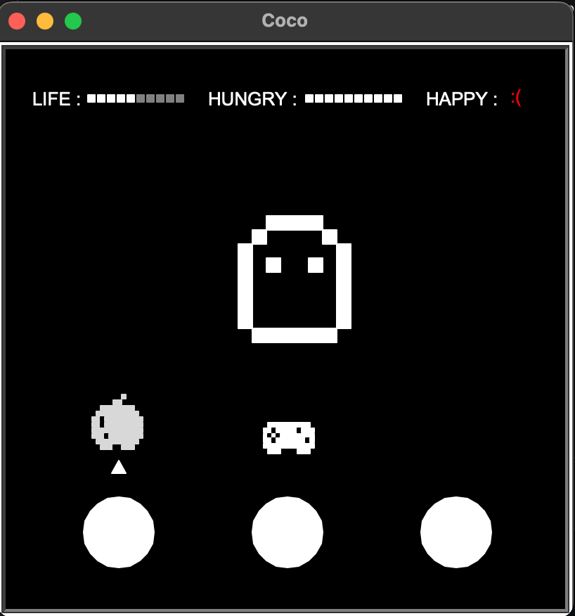
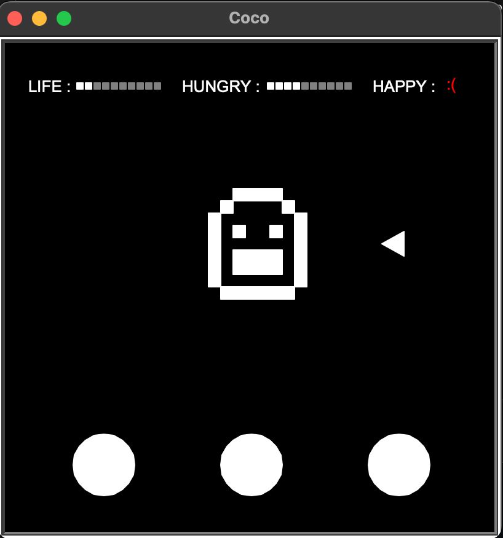
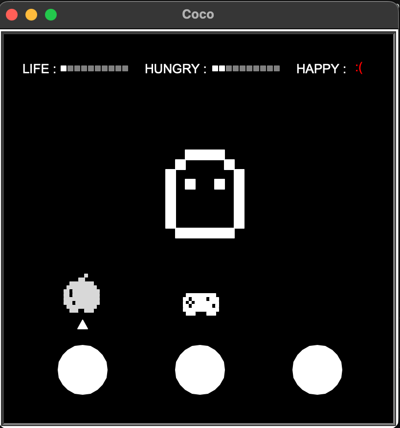

<h2> TAMAGOTCHI V0.1 </h2>

Tamagotchi Pet made in Python 3 with Turtle and Pygame.

This code is for free use. The script and the song was made 100% by me.

<h3>Take care</h3>

<h3>Play</h3>

<h3>Don't let him die</h3>

Created by: © Tomas Serra 
